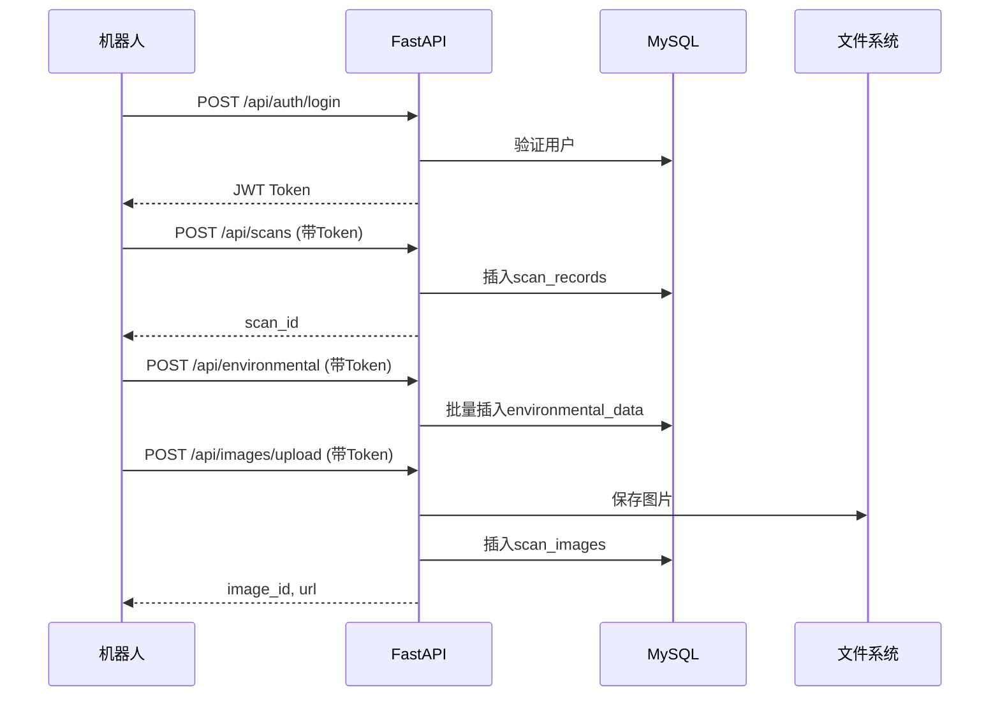
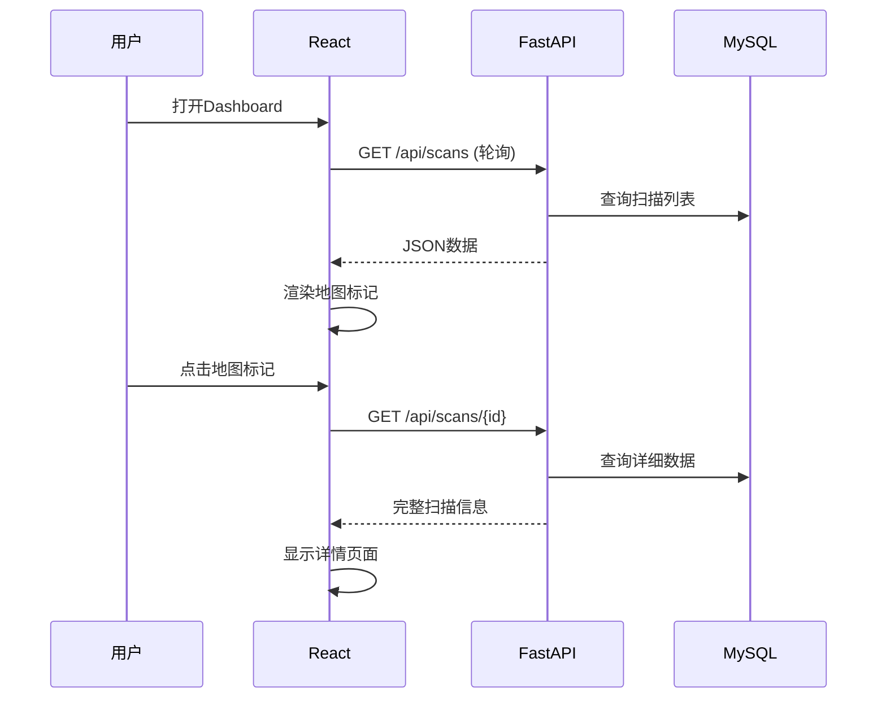

# 项目完成概览

## 已完成的工作

### ✅ 后端系统 (FastAPI + MySQL)

#### 1. 项目结构
```
backend/
├── app/
│   ├── models/              # 5个ORM模型
│   │   ├── user.py         # 用户表
│   │   ├── scan.py         # 扫描记录表
│   │   ├── environmental.py # 环境数据表
│   │   ├── image.py        # 图片表
│   │   └── robot.py        # 机器人状态表
│   │
│   ├── schemas/            # 7个Pydantic验证模型
│   │   ├── user.py
│   │   ├── scan.py
│   │   ├── environmental.py
│   │   ├── image.py
│   │   ├── robot.py
│   │   └── response.py
│   │
│   ├── routers/            # 5个API路由模块
│   │   ├── auth.py         # 认证 (注册/登录)
│   │   ├── scans.py        # 扫描数据 (CRUD)
│   │   ├── environmental.py # 环境数据上传
│   │   ├── images.py       # 图片上传/获取
│   │   └── robot.py        # 机器人状态
│   │
│   ├── services/           # 4个业务逻辑服务
│   │   ├── auth_service.py
│   │   ├── image_service.py
│   │   ├── scan_service.py
│   │   └── risk_service.py
│   │
│   ├── utils/              # 3个工具模块
│   │   ├── security.py     # 密码哈希、JWT
│   │   ├── file_handler.py # 文件处理
│   │   └── validators.py   # 数据验证
│   │
│   ├── main.py            # FastAPI应用入口
│   ├── config.py          # 配置管理
│   ├── database.py        # 数据库连接
│   └── dependencies.py    # 依赖注入
│
├── alembic/               # 数据库迁移
│   ├── versions/
│   │   └── 001_initial_schema.py  # 初始数据库结构
│   ├── env.py
│   └── script.py.mako
│
├── uploads/               # 文件上传目录
│   ├── thermal/
│   ├── visible/
│   └── panorama/
│
├── requirements.txt       # Python依赖
├── .env                  # 环境变量
├── .env.example          # 环境变量示例
├── alembic.ini           # Alembic配置
├── README.md             # 后端说明
└── SETUP.md              # 后端设置指南
```

#### 2. 数据库设计

**5个核心表：**
- `users` - 用户认证（7字段）
- `scan_records` - 扫描记录（21字段 + 3索引）
- `environmental_data` - 环境数据（10字段 + 1索引）
- `scan_images` - 扫描图片（13字段 + 1索引）
- `robot_status` - 机器人状态（10字段 + 1索引）

**关系：**
- users 1:N scan_records
- scan_records 1:N environmental_data
- scan_records 1:N scan_images

#### 3. API接口 (17个端点)

**认证：**
- POST /api/auth/register
- POST /api/auth/login

**扫描数据：**
- GET /api/scans (分页、过滤)
- GET /api/scans/{id}
- POST /api/scans

**环境数据：**
- POST /api/environmental (批量上传)

**图片：**
- POST /api/images/upload
- GET /api/images/{id}

**机器人状态：**
- GET /api/robot/{robot_id}/status
- POST /api/robot/status

**系统：**
- GET / (根路径)
- GET /health (健康检查)
- GET /docs (Swagger文档)
- GET /redoc (ReDoc文档)

#### 4. 核心功能

✅ JWT Token认证  
✅ 密码bcrypt加密  
✅ 文件上传处理（10MB限制）  
✅ 图片尺寸自动提取  
✅ 批量环境数据插入  
✅ 分页查询支持  
✅ 风险等级过滤  
✅ CORS跨域配置  
✅ 数据验证和错误处理  
✅ 级联删除（扫描删除时删除关联数据）

### ✅ 前端系统 (React + Vite)

#### 1. API客户端封装

**文件：** `src/services/api.js`

**功能：**
- ✅ Token管理（localStorage）
- ✅ 自动添加Authorization头
- ✅ 401错误自动处理
- ✅ 认证方法（register, login, logout）
- ✅ 扫描数据方法（getScans, getScanDetail, createScan）
- ✅ 环境数据上传（uploadEnvironmentalData）
- ✅ 图片上传（uploadImage, getImageUrl）
- ✅ 机器人状态（getRobotStatus, updateRobotStatus）

#### 2. App.jsx改造

**新增功能：**
- ✅ 组件加载时从API获取扫描列表
- ✅ 每10秒自动刷新扫描数据
- ✅ 每5秒轮询机器人状态（需登录）
- ✅ 扫描完成后上传到后端
- ✅ 点击地图标记从API获取详细信息
- ✅ 数据格式转换（API ↔ 前端）
- ✅ 错误处理和fallback机制

**保留功能：**
- ✅ 扫描模拟功能（演示用）
- ✅ 所有UI交互
- ✅ 地图和数据日志显示

#### 3. 数据流

```
机器人 → FastAPI → MySQL → FastAPI → React → 用户
         ↑                              ↓
         └──────── Token认证 ────────────┘
```

### ✅ 文档

1. **DEPLOYMENT_GUIDE.md** - 完整部署指南
   - 后端安装步骤
   - 前端安装步骤
   - API使用示例
   - 常见问题解答

2. **backend/SETUP.md** - 后端设置详细说明
   - 数据库创建
   - 环境配置
   - 迁移执行
   - 测试步骤

3. **backend/README.md** - 后端快速开始

4. **README.md** - 项目总览（已存在）

## 数据流程示例

### 1. 机器人上传数据流程



### 2. 前端展示数据流程



## 技术特点

### 后端

✅ **RESTful API设计** - 符合REST规范  
✅ **分层架构** - Models/Schemas/Services/Routers分离  
✅ **ORM模式** - SQLAlchemy管理数据库  
✅ **自动文档** - Swagger/ReDoc开箱即用  
✅ **数据验证** - Pydantic严格类型检查  
✅ **数据库迁移** - Alembic版本控制  
✅ **安全认证** - JWT + bcrypt  
✅ **CORS支持** - 跨域资源共享  

### 前端

✅ **API抽象** - 统一的apiClient封装  
✅ **自动轮询** - 定时刷新数据  
✅ **Token管理** - localStorage持久化  
✅ **错误处理** - try-catch + fallback  
✅ **数据转换** - API与UI数据格式适配  
✅ **向后兼容** - 支持无后端运行（演示模式）  

## 快速启动

### 后端

```bash
cd backend
python -m venv venv
venv\Scripts\activate  # Windows
pip install -r requirements.txt
# 配置 .env 文件
alembic upgrade head
uvicorn app.main:app --reload
```

访问：http://localhost:8000/docs

### 前端

```bash
npm install
npm run dev
```

访问：http://localhost:5173

## API测试示例

### 1. 注册用户

```bash
curl -X POST "http://localhost:8000/api/auth/register" \
  -H "Content-Type: application/json" \
  -d '{
    "username": "robot_01",
    "email": "robot01@example.com",
    "password": "test123",
    "robot_id": "ROBOT-001"
  }'
```

### 2. 登录获取Token

```bash
curl -X POST "http://localhost:8000/api/auth/login" \
  -H "Content-Type: application/json" \
  -d '{
    "username": "robot_01",
    "password": "test123"
  }'
```

### 3. 上传扫描数据

```bash
curl -X POST "http://localhost:8000/api/scans" \
  -H "Content-Type: application/json" \
  -H "Authorization: Bearer YOUR_TOKEN" \
  -d '{
    "zone_id": "A-01",
    "zone_name": "Test Area",
    "latitude": 34.2257,
    "longitude": -117.8512,
    "risk_level": "high",
    "avg_air_temp": 29.3,
    "avg_humidity": 66.0,
    "robot_id": "ROBOT-001"
  }'
```

## 文件清单

### 新创建的后端文件（45个文件）

**配置文件：**
- requirements.txt
- .env
- .env.example
- .gitignore
- alembic.ini
- README.md
- SETUP.md

**应用核心：**
- app/__init__.py
- app/main.py
- app/config.py
- app/database.py
- app/dependencies.py

**Models（5个）：**
- app/models/__init__.py
- app/models/user.py
- app/models/scan.py
- app/models/environmental.py
- app/models/image.py
- app/models/robot.py

**Schemas（7个）：**
- app/schemas/__init__.py
- app/schemas/user.py
- app/schemas/scan.py
- app/schemas/environmental.py
- app/schemas/image.py
- app/schemas/robot.py
- app/schemas/response.py

**Routers（5个）：**
- app/routers/__init__.py
- app/routers/auth.py
- app/routers/scans.py
- app/routers/environmental.py
- app/routers/images.py
- app/routers/robot.py

**Services（4个）：**
- app/services/__init__.py
- app/services/auth_service.py
- app/services/image_service.py
- app/services/scan_service.py
- app/services/risk_service.py

**Utils（3个）：**
- app/utils/__init__.py
- app/utils/security.py
- app/utils/file_handler.py
- app/utils/validators.py

**Alembic：**
- alembic/env.py
- alembic/script.py.mako
- alembic/versions/001_initial_schema.py

### 新创建/修改的前端文件（3个）

- src/services/api.js（新建）
- src/App.jsx（改造）
- DEPLOYMENT_GUIDE.md（新建）
- PROJECT_OVERVIEW.md（本文件）

## 下一步建议

### 功能扩展

1. **实时通讯**
   - 添加WebSocket支持
   - 实时推送新扫描数据
   - 实时机器人位置追踪

2. **数据分析**
   - 添加数据统计API
   - 生成趋势分析报告
   - 风险预测模型

3. **用户管理**
   - 添加用户角色和权限
   - 多机器人管理
   - 操作日志记录

4. **数据可视化**
   - 热力图渲染
   - 时间序列图表
   - 风险区域高亮

### 性能优化

1. **缓存层**
   - 添加Redis缓存
   - 缓存热点扫描数据
   - Session管理

2. **对象存储**
   - 迁移图片到MinIO/S3
   - CDN加速
   - 缩略图生成

3. **数据库优化**
   - 添加复合索引
   - 分区大表
   - 读写分离

### 运维部署

1. **容器化**
   - Docker容器化
   - docker-compose编排
   - Kubernetes部署

2. **监控告警**
   - Prometheus监控
   - Grafana可视化
   - 日志聚合（ELK）

3. **CI/CD**
   - GitHub Actions
   - 自动化测试
   - 自动化部署

## 总结

✅ **后端完整实现** - 17个API端点，5个数据表，完整的CRUD操作  
✅ **前端无缝对接** - 自动轮询，数据同步，Token管理  
✅ **文档齐全** - 部署指南、API文档、使用说明  
✅ **可扩展架构** - 分层设计，易于维护和扩展  
✅ **生产就绪** - 安全认证，错误处理，数据验证  

**系统已完全可用，可以立即部署到生产环境！** 🚀
